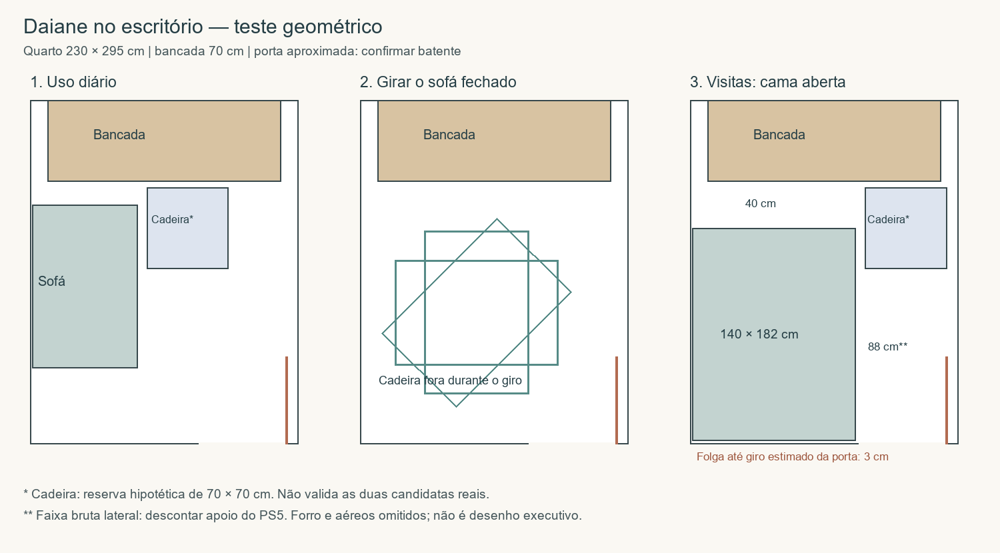

> **Requisito F92:** cadeira pode sair apenas durante a manobra; depois deve voltar e permanecer no escritório durante a hospedagem. Alternativa anterior de guarda externa nas visitas está descartada. Estacionamento interno ainda a validar.

> **Disposição vigente — F89:** consulte o [documento consolidado do escritório](README.md). Este estudo preserva etapas anteriores; a posição diária atual do Daiane é junto à parede da porta, conforme R07. Dimensões e coordenadas antigas não prevalecem sobre a consolidação.

# Encaixe do Daiane — R06

Teste geométrico solicitado por Elias. Não é levantamento acabado nem validação executiva.

## Bases

Planta oficial P01 visualmente conferida: dormitório 02 de 230 × 295 cm; porta na parede inferior, abrindo para dentro junto à direita. Posição exata e largura do vão sem cotas específicas: mantida hipótese R01 de dobradiça em (220,295), folha de 75 cm, varrendo x145..220 e y220..295. Bancada 200 × 70 cm, centralizada, x15..215 e y0..70; largura ainda proposta. Origem no canto da janela à esquerda, x para direita e y para entrada.

Daiane de referência: 140 × 90 cm fechado e 140 × 182 cm aberto. Ensaiados afastamentos de 2 cm à lateral e 3 cm à parede de entrada, apenas hipóteses que precisam ser compatíveis com rodapés e instruções do produto. Almofadas, volume do operador e mecanismo intermediário não modelados. Modelo Daiane e cor cinza-claro escolhidos.

## Resultado e trajetória

- Dia: sofá lateral esquerdo, x2..92, y90..230. Reserva de cadeira de 70 × 70 cm em x100..170, y75..145, com 8 cm entre envelopes laterais. Não representa espaço corporal ou cadeira reclinada, nem prova ergonomia. Posição do assento de trabalho precisa ser alinhada ao setup.
- Retirar cadeira e itens soltos temporariamente do escritório antes de mover sofá; destino transitório fora do cômodo a definir sem bloquear circulação.
- Porta completamente aberta durante a manobra. Transladar sofá fechado do centro (47,160) ao centro (100,182,5), girar 90° nesse centro, depois transladar ao centro (72,247). O retângulo fechado passa de 90 × 140 para 140 × 90 cm.
- Verificação numérica de 292 poses da trajetória: sem cruzar paredes ou bancada. Menores distâncias para esquerda/direita/frente da bancada/parede da entrada: 2/46,78/20/3 cm. A rotação tem círculo envolvente de raio 83,22 cm, inteiramente dentro da área atrás da bancada; as translações lineares a orientação fixa também permanecem dentro. Isso verifica o envelope rígido, não esforço, pés, tecidos, mãos do operador ou mecanismo.
- Abrir em direção à janela: envelope final x2..142, y110..292. Folga até bancada de 40 cm; faixa bruta lateral direita de 88 cm; margem lateral ao limite hipotético do giro da porta de apenas 3 cm. A porta não se sobrepõe à cama nesse ensaio, mas resultado é sensível ao batente e às tolerâncias.
- A sobra frontal de 40 cm não é corredor de uso da estação. Acesso aos hóspedes pela lateral direita; cama encostada à esquerda tem acesso por um lado.

## Cadeira e apoio do PS5

Depois de abrir a cama, uma reserva hipotética de cadeira de 70 × 70 cm pode estacionar junto ao canto direito da bancada, x150..220 e y75..145, sem sobreposição com cama ou giro da porta. Há 8 cm entre cadeira e cama, portanto não permite passagem à bancada por esse ponto. Não comprova dimensões das candidatas GenioDesk/LiberNovo. Se a cadeira real exceder essa reserva ou não puder ser movimentada até ali, precisará ficar fora do escritório nas visitas; nenhum local externo definitivo foi validado.

O apoio do PS5 não foi dimensionado. Com profundidade hipotética de 30 cm na parede direita, a faixa lateral da cama cai de 88 para 58 cm no trecho do apoio; o envelope da manobra testada teria pelo menos 16,78 cm até essa projeção. Isso não aprova profundidade, ventilação ou altura do apoio, nem exclui risco de contato com o corpo. Evitar colocá-lo no trecho varrido pela porta (y220..295 nesta hipótese). Não acrescentar módulo baixo para volante. Aéreos acima do sofá não entram na projeção do piso; portas abertas, alturas e acesso não modelados.

## Conclusão

Daiane é geometricamente compatível com a proposta sob as hipóteses declaradas. Confirmação mais sensível: margem junto ao vão original, de apenas 3 cm. Alturas/volumes da cadeira, apoio do PS5, operação do mecanismo e medidas acabadas ainda necessários para fechar o encaixe. Não alterar portas ou bancada para forçar aprovação. Medidas internas do baú e área plana útil da cama continuam pendentes; este teste não as resolve.
