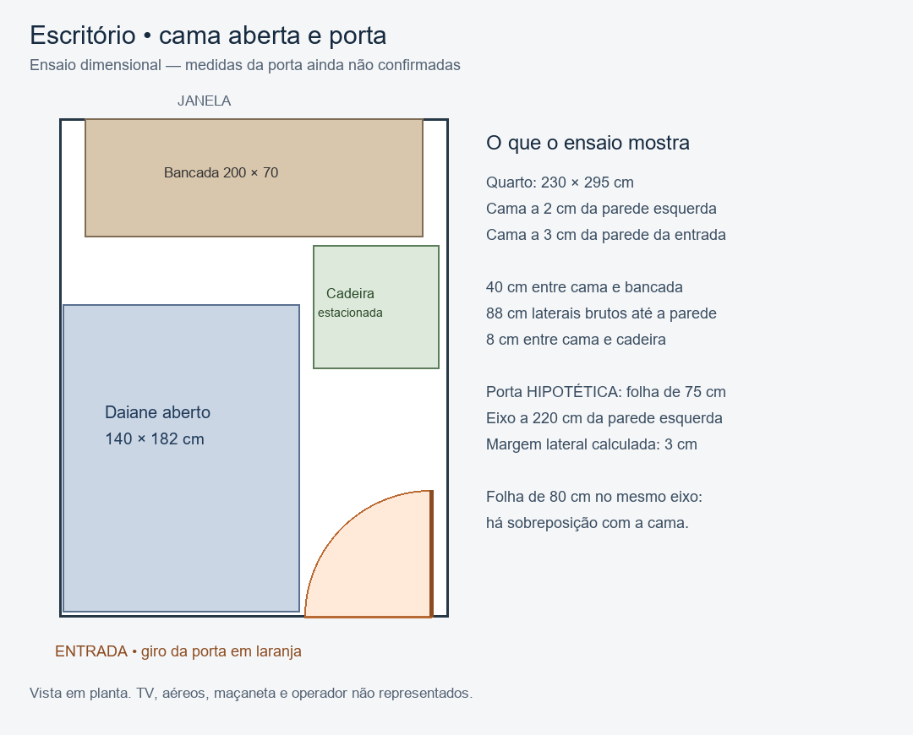

# Sofá-cama e porta — conferência F100

Elias solicita conferir sofá-cama e porta. Planta P01 revista visualmente: dormitório02 com230 ×295 cm; porta de entrada no canto direito, abrindo para dentro. Não há cota específica legível de largura da folha nem posição do eixo/batente. Não extrair centímetros executivos da escala gráfica.

## Referência do sofá reconferida

[Mobly, Daiane Veludo Light Cinza](https://www.mobly.com.br/sofacama-daiane-veludo-light-cinza-974920.html), consultada nesta rodada: fechado140 L ×90 P ×85 A cm; aberto140 L ×182 P ×55 A cm. Página identifica marca Modern, pés fixos,48 kg, encosto reclinável e assento retrátil. Área plana de dormir e interior do baú não têm medidas confirmadas. Medidas externas não validam colchão útil de140 ×182. Mecanismo intermediário e espaço necessário atrás ainda precisam de conferência; não concluir que3 cm de recuo permitem operar a abertura apenas por conhecer tamanho final.

## Implantação retomada

Origem na janela, x da esquerda para direita, y rumo à entrada. Cama x2..142,y110..292. Bancada y0..70. Cadeira estacionada x150..224,5,y75..148. Mantém40 cm até bancada,88 cm brutos à direita e8 cm até cadeira, sem acesso para usar a estação durante hospedagem. TV/suporte podem reduzir passagem em altura; diagrama não os representa.

Hipótese de porta: eixo(220,295), folha75 cm, setor varrido de90 graus para dentro rumo à direita. Limite esquerdo do setor x145. Cama termina x142: diferença lateral3 cm. Batente, espessura de folha, maçaneta, roupa de cama e tolerâncias não modelados.

## Sensibilidade do encaixe

| Hipótese, mantendo cama e demais medidas | Diferença lateral ao limite do giro |
|---|---|
| Eixo220, folha70 cm | +8 cm |
| Eixo220, folha75 cm | +3 cm |
| Eixo220, folha80 cm | −2 cm; há interferência no setor ideal |
| Eixo218, folha75 cm | +1 cm |
| Eixo215, folha75 cm | −2 cm; há interferência no setor ideal |

São cenários, não medidas da porta Cury. Regra conservadora em planta: margem lateral = posição do eixo desde a parede esquerda − largura radial da folha − (recuo esquerdo da cama + largura externa da cama). Para140 cm de cama e2 cm de recuo, margem= eixo−folha−142. O alcance efetivo com ferragens pode ser diferente.

Os3 cm são margem lateral do retângulo envolvente. A distância mínima exata da cama ao setor ideal de75 cm é aproximadamente sqrt(78²+3²)−75=3,06 cm: praticamente a mesma fragilidade, não uma folga adicional relevante.

## Afastar a cama da parede da entrada ajuda?

No cenário ideal de eixo220 e folha75, obter5 cm até o arco mantendo cama x2..142 requer recuo traseiro de aproximadamente17,8 cm: sqrt((75+5)²−78²). A cama começaria em y95,2, deixando apenas25,2 cm até bancada, contra40 atuais. Logo, puxar o sofá poucos centímetros para a janela não cria automaticamente folga lateral relevante. Essa alternativa troca espaço da frente por margem no giro e exige novo teste completo de abertura/manobra. Não adotada como solução.

Os5 cm aqui são um critério comparativo escolhido para o cálculo, não norma ou garantia de uso. Não propor encostar tecido à parede para ganhar os2 cm laterais; rodapé e mecanismo precisam de espaço real.

## Resultado e próximo dado necessário

O tamanho final da cama cabe no cômodo sob as hipóteses, mas o encaixe com a porta permanece condicional e sensível. Manter Daiane e porta original como base; nenhuma necessidade de trocar porta ou sofá está demonstrada por medidas reais nesta rodada. Não declarar fechamento executivo aprovado.

Para resolver a margem, obter juntos: (1) distância acabada da parede esquerda ao eixo das dobradiças, (2) largura real da folha e seu alcance com ferragens, (3) recuo ocupado por rodapé/batente, e (4) instrução ou demonstração de abertura da versão Daiane. Uma planta cotada de portas pode resolver os primeiros itens antes da entrega. Vídeo sem referência dimensional pode mostrar sentido e mecanismo, mas não certificar margem de3 cm.

A trajetória com cadeira dentro, de F94, permanece outro teste: operador e abertura intermediária não foram validados apenas por esta conferência de posição final.
