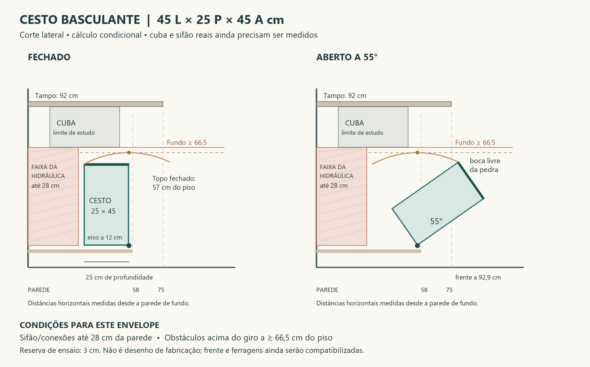

# Cesto basculante — cálculo preliminar R04

**27/09/2026 — frente e continuidade visual aprovadas:** Elias confirmou “sim, quero manter a continuidade da cozinha se estendendo para a lavanderia” à proposta de frente lisa em Greenplac Arenza, ventilação discreta e pega discreta na borda superior. Adotar essa composição no cesto basculante, dando continuidade aos armários inferiores da cozinha. A referência ripada da R03 permanece como origem do mecanismo, não acabamento da frente. Posição/dimensionamento da ventilação, perfil da pega, alinhamentos e ferragens a detalhar. Esta decisão não altera os superiores, a chapa do varal ou o tratamento do aquecedor.

**27/09/2026 — recipiente interno escolhido:** Elias escolheu “saco removivel” entre saco removível/lavável e cesto rígido vazado. Adotar saco removível e lavável no interior do conjunto basculante. Tecido, fixação à armação, alças e dimensões úteis ainda a detalhar; o envelope calculado abaixo continua referência do conjunto móvel, não molde do saco nem capacidade útil comprovada. Preservar a remoção da armação/frente quando necessária para manutenção do sifão.

**Solução aprovada por Elias, condicionada à remoção fácil para manutenção do sifão.** Referência aceita para detalhamento: envelope móvel de **45 cm de largura × 25 cm de profundidade × 45 cm de altura, abertura de 55°**. A aprovação encerra a escolha do cesto basculante; não substitui a conferência dimensional para fabricar. Ainda não existe corte medido da cuba, válvula e sifão. O cálculo abaixo informa as condições que essas peças precisam atender; não afirma que a instalação real já as atende.

## Requisito aprovado de manutenção

**Complemento de 27/09/2026:** após a proposta de alças para transportar a roupa e encaixes simples para soltar o saco, Elias respondeu “ok, seguimos”. Incorporar esses recursos como direção de detalhamento; tipo de engate, material e dimensionamento permanecem a especificar. A retirada do saco no uso diário é distinta da remoção da estrutura necessária para manutenção do sifão.

Elias aprovou: “ok gostei e sendo de facil remoção caso precisa fazer manutenção no sifão eu aprovo”. O conjunto precisa permitir retirar facilmente o cesto e liberar acesso efetivo ao sifão, sem desmontar tanque ou bancada. Se armação ou frente basculante bloquearem o trabalho, também devem permitir retirada simples pela frente, com fixações acessíveis. Retirar apenas o saco não satisfaz o requisito quando restar uma estrutura obstruindo as conexões.

Diretriz de detalhamento: preferir engates ou travas acessíveis, com retenção contra soltura acidental no uso. A ferragem específica e a necessidade de ferramenta simples permanecem a definir; não foi exigida nem comprovada remoção sem ferramentas. No ensaio, conferir retirada do cesto, acesso às uniões do sifão, espaço para desmontagem e recolocação do conjunto. Essa verificação é condição para aceitar a ferragem, sem reabrir a preferência já aprovada.

## 1. Premissas e origem

Todas as medidas estão em centímetros. Distância horizontal medida a partir da parede de fundo, para a frente do gabinete; altura medida a partir do piso acabado.

| Dado | Valor | Origem/status |
|---|---:|---|
| Gabinete externo, largura × profundidade | 59 × 58 | Modelo ilustrativo existente, não levantamento |
| Tampo, altura superior / projeção desde a parede | 92 / 75 | Modelo ilustrativo existente |
| Topo da base interna | 9,8 | Hipótese anterior: início a 8 + chapa de 1,8 |
| Laterais do gabinete | 1,8 cada | Hipótese para conta de largura |
| Eixo de giro, distância à parede / altura do piso | 56 / 12 | Proposta deste estudo; não é furação definida |
| Cesto e armação móvel, envelope externo L × P × A | 45 × 25 × 45 | Inclui aros, alças e recipiente; ferragem externa e frente decorativa precisam de verificação própria |
| Abertura a partir da vertical fechada | 55° | Proposta geométrica; ferragem e conforto ainda não selecionados/validados |
| Folga geométrica de ensaio | 3 | Reserva adotada, não norma nem espaço suficiente de manutenção |

Modelo de movimento: recipiente contido num retângulo rígido lateral, com eixo na sua quina inferior frontal. Não representa o mecanismo exato do anúncio. Se o eixo real estiver deslocado, houver suporte pendular ou deformação do saco, recalcular. Roupa não pode ultrapassar o envelope usado para conferir colisões.

## 2. Sifão atrás: limitar profundidade, não toda a altura

Fechado, o cesto fica entre **31 e 56 cm da parede**, pois 56 − 25 = 31. Durante a abertura de 0 a 55°, nenhum ponto desse envelope recua além dos 31 cm: o ponto mais próximo da parede é a quina inferior traseira, cuja distância cresce de 31 cm até 41,7 cm.

Uma condição suficiente para separar cesto e hidráulica é manter **todo o volume das conexões que se sobrepõe lateralmente ao cesto até 28 cm da parede**. Isso deixa pelo menos 3 cm de separação horizontal durante todo o giro. É o limite proposto para verificar, não uma posição medida nem autorização para mudar esgoto. Válvula, mangueiras, abraçadeiras e suportes também entram na conferência.

Regra para adaptar a profundidade: **P máxima = posição do eixo − avanço frontal da hidráulica − folga**. Com eixo a 56 cm e folga de 3 cm:

| Frente mais avançada da hidráulica, desde a parede | Profundidade máxima por esse critério |
|---|---:|
| 25 | 28 |
| 28 | 25 |
| 30 | 23 |
| 33 | 20 |

Esse critério é conservador: uma peça que passa inteiramente acima ou ao lado da trajetória pode exigir análise localizada, em vez de reduzir todo o cesto. Não forçar sifão para atender à tabela. Acesso para desmontagem será verificado com o cesto retirado.

## 3. Cuba acima: conferir o pico no meio da abertura

O topo fechado fica a **57 cm** do piso. Durante o giro, a quina superior traseira sobe e atinge **63,48 cm**, com abertura de **29,05°**. Depois desce. Conferir apenas fechado e totalmente aberto esconderia esse pico.

Com 3 cm de reserva, uma condição suficiente é que **o fundo externo da cuba e qualquer obstáculo superior na faixa varrida fiquem a pelo menos 66,5 cm do piso**. Essa condição permite tanque com descida externa máxima de aproximadamente **25,5 cm desde o topo do tampo a 92 cm**, incluindo espessuras e apoios que ocupem essa região. Não confundir essa descida externa com profundidade útil de água.

Se a cuba descer mais, reduzir altura/profundidade do cesto ou redesenhar sua seção e trajetória. Não diminuir o tanque automaticamente, pois ele também é o apoio aprovado da roupa molhada.

## 4. Abertura para além da bancada

A 55°, a boca do cesto vai de **78,52 a 92,86 cm da parede**. A bancada termina a 75 cm: a boca inteira passa da sua projeção, com aproximadamente **3,5 cm entre a borda traseira da boca e a linha da pedra**. A frente avança 17,9 cm além da pedra; a boca mantém 25 cm de profundidade inclinada, mas sua projeção horizontal é de apenas 14,3 cm.

Alturas da boca aberta: **37,8 cm na frente e 58,3 cm atrás**. O acesso é baixo, exige inclinação do corpo e precisa de ensaio de uso. A saída da projeção da pedra comprova geometria em planta do corte, não conforto nem retirada integral do recipiente. Testar a retirada cheia; um saco flexível e removível pode facilitar, mas não comprova sozinho o percurso.

Na seção de 154 cm anteriormente utilizada, restariam 61,1 cm em linha depois do envelope do cesto aberto. Não é passagem livre comprovada: descontar frente decorativa, ferragens, pessoa e interferências; a lixeira mantém sua posição.

## 5. Largura e escolha provisória

Gabinete de 59 cm menos duas laterais de 1,8 cm = **55,4 cm internos nominais**. Cesto de 45 cm deixa **10,4 cm totais**, ou 5,2 cm por lado se centralizado, para folgas e ferragens. Conferir consumo real da ferragem e proteção lateral do conjunto. Essa reserva não dimensiona pivôs, carga, parafusos ou estrutura da pedra.

O envelope externo retangular tem volume geométrico de 50,625 litros. **Isso não é capacidade útil de roupa**: aros, tecido, forma real e limite de enchimento diminuem o volume. Não prometer um lote de lavagem com essa conta.

| Alternativa L × P × A | Fundo de cuba/obstáculo superior mínimo, com reserva | Abertura de ensaio para expor a boca além da pedra |
|---|---:|---:|
| 45 × 25 × 40 | 62,2 cm do piso | 60° |
| **45 × 25 × 45** | **66,5 cm do piso** | **55°** |
| 45 × 25 × 50 | 71,0 cm do piso | 50° |

Mantidos eixo a 56/12 cm e hidráulica até 28 cm da parede. A alternativa de 40 cm abre com a borda frontal da boca a apenas 32 cm do piso; perde conforto de acesso. A de 50 cm exige cuba menos profunda. A proposta de 45 cm é ponto inicial de compatibilização, não ótimo comprovado.

## 6. Memória de cálculo e verificações

Para um ponto do retângulo com profundidade interna `u` (0 a P, da frente para trás) e altura `v` (0 a A):

`distância à parede = 56 − u × cos(θ) + v × sen(θ)`

`altura do piso = 12 + u × sen(θ) + v × cos(θ)`

O máximo superior entre 0 e 55° é `12 + raiz(P² + A²)`, porque o ângulo do pico `atan(P/A)` está dentro do curso. Altura máxima permitida do cesto, por uma cota superior livre B e reserva F: `A ≤ raiz((B − 12 − F)² − P²)`, quando essa expressão for real e o pico estiver no intervalo; para outro curso, verificar os extremos e o pico aplicável.

Conferência numérica realizada nas quatro quinas em 5.501 posições entre 0 e 55°, confrontada com máximos analíticos. Isso valida o cálculo do envelope idealizado; não valida o conjunto físico ainda desconhecido.

**Para fechar fabricação:** obter seção cotada da cuba/apoios e volume das conexões, confirmar gabinete/eixo, selecionar mecanismo com limite de abertura e retenção apropriados à carga e testar acesso/retirada. O conjunto deve ser removível para manutenção. Não escolher material, carga ou ferragem com base só na geometria.

Base local: [R03](Cesto_basculante_sob_tanque_R03.md), [R02](Tanque_corte_e_retirada_R02.md) e [R01](Tanque_sifao_e_cesto_R01.md). Pontos hidráulicos, posição da máquina/lixeira e modelo geral do apartamento permanecem sem alteração neste cálculo.
