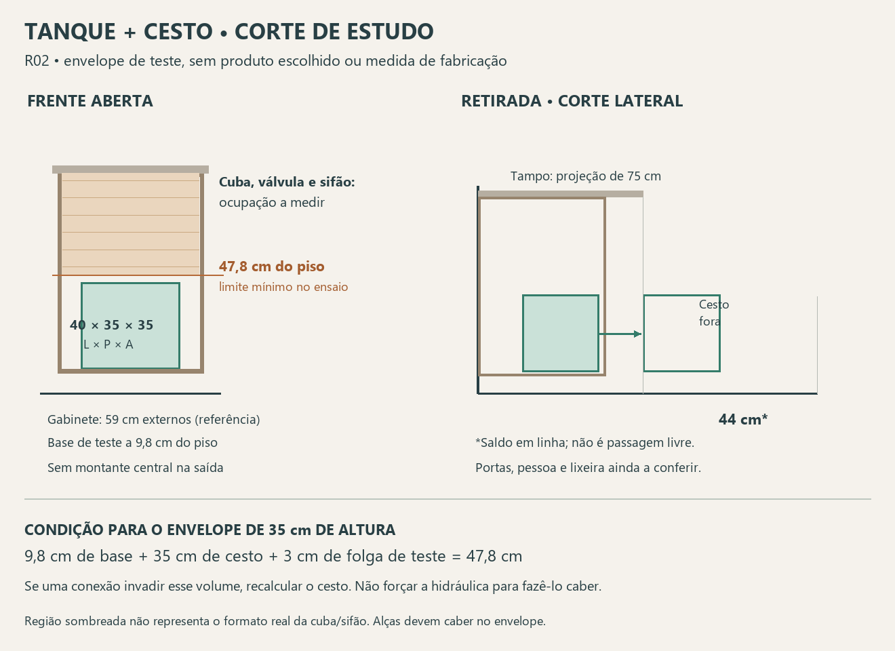

# Tanque e cesto — corte condicional e retirada R02

**Revisão posterior:** Elias sugeriu a [alternativa basculante R03](Cesto_basculante_sob_tanque_R03.md). Este corte permanece como ensaio do cesto baixo; seus 35 cm não são limite de altura. Não aplicar a cota mais baixa de um sifão posterior a toda a região frontal nem tratar as duas portas como escolha aprovada.

Estudo solicitado na continuidade da revisão R01. **Desenho condicional, não levantamento ou projeto de fabricação.** Não foram obtidas novas cotas de cuba, válvula, sifão ou estrutura.

## Envelope inicial para testar

Adotar no desenho um **volume externo de teste de 40 cm de largura × 35 cm de profundidade × 35 cm de altura**, já incluindo as alças. Não é cesto escolhido, indicação de capacidade ou autorização de compra. Serve para verificar quais medidas da instalação precisam ser atendidas.

Referências do modelo: gabinete de 59 × 58 cm em planta, início a 8 cm do piso; tampo a 92 cm com projeção de 75 cm. Para as contas, usar laterais e base **hipotéticas de 1,8 cm**, sem escolher espessura de marcenaria. A proteção lateral de 1 cm deve ser compatibilizada no conjunto; não reduzir silenciosamente o vão da máquina ou o gabinete para absorvê-la.

## 1. Corte frontal: altura que precisa ficar livre

- Topo da base de apoio do cesto: **8 + 1,8 = 9,8 cm** do piso.
- Topo do volume de cesto de 35 cm: **9,8 + 35 = 44,8 cm**.
- Acrescentando **3 cm de folga de teste** acima do envelope: o primeiro obstáculo na região de passagem precisa estar a **47,8 cm ou mais** do piso.

Os 3 cm são reserva de ensaio, não distância normativa nem comprovação de espaço para a mão. Confirmar pega frontal/lateral e acesso às alças; se a mão exigir mais folga, ampliar a reserva e recalcular.

**A cota decisiva não é somente o fundo da cuba:** é o elemento mais baixo que intercepta a posição ou o percurso do cesto, podendo ser válvula, sifão, flexível, apoio ou travessa. Tubulação fora desse volume não reduz automaticamente toda a altura do gabinete, mas ainda exige acesso de manutenção.

| Altura do obstáculo sobre o percurso, hipótese | Altura externa máxima do cesto neste ensaio |
|---|---:|
| 45 cm do piso | 32,2 cm |
| 50 cm do piso | 37,2 cm |
| 55 cm do piso | 42,2 cm |

Cálculo: altura do obstáculo menos 9,8 cm da base e menos 3 cm da folga de teste. Não são cotas medidas da hidráulica. Não deslocar ou adaptar o sifão apenas para atender a essa conta.

## 2. Largura e abertura das portas

O cenário de 59 cm externos e laterais de 1,8 cm deixa **55,4 cm entre as faces internas**, antes de dobradiças e interferências. O envelope de 40 cm deixaria **15,4 cm de diferença total**, que não deve ser convertida em promessa de folga lateral útil.

Manter a proposta de duas portas e ausência de montante central fixo na passagem, com estrutura da bancada compatibilizada. Uma folha nominal de cerca de metade dos 59 cm não libera sozinha a largura de 40 cm; a retirada deve ser verificada com ambas abertas. Não definir ângulo de abertura ou dobradiça antes de conferir modelo, espessuras, lixeira e máquina.

No corte lateral, a posição do cesto no fundo do gabinete é ilustrativa. A diferença entre profundidade externa do móvel e a do cesto não constitui uma faixa hidráulica livre garantida: descontar frente, fundo, recuos e projeções reais das conexões.

## 3. Percurso de retirada

Sequência de estudo: abrir as duas portas, pegar as alças acessíveis, trazer o cesto pela abertura frontal e levá-lo para o lado da cozinha, sem atingir cuba/sifão. O desenho compara uma retirada reta seguida de elevação livre na frente da pedra; não afirma que seja o único percurso possível.

Quando a parte traseira do cesto de 35 cm chega à linha do tampo a 75 cm da parede, a frente chega a **110 cm**. Até o limite oposto de 154 cm restam **44 cm em linha**, antes da pessoa, folgas, portas e lixeira. Essa sobra não é passagem garantida.

O gabinete termina no cenário a 58 cm da parede, **17 cm antes do tampo**. Logo, ultrapassar a frente do gabinete não significa que o cesto esteja livre da projeção da pedra. A saída lateral ou uma elevação parcial pode ser melhor, mas exige testar o volume completo, sem inclinar o cesto carregado contra as conexões.

Fazer a conferência preferencialmente com varal vazio no alto e máquina fechada. O espaço no piso deve considerar a lixeira Loop mantida no local aprovado; ela não foi movida para fazer o desenho caber.

## 4. O que o corte permite concluir

O volume de **40 × 35 × 35 cm** é uma referência razoável para testar a abertura e a altura; **o cabimento ainda não está demonstrado**. A condição de altura ficou explícita: conhecer a cota do obstáculo real na região do cesto e compará-la com 47,8 cm neste cenário.

Não atribuir litros ao envelope externo nem declarar capacidade de um lote de roupa. O tanque continua sendo o apoio temporário aprovado; este cesto é o removível sob o tanque. Profundidade/volume úteis do tanque e acesso às últimas peças durante preenchimento do varal seguem para conferência.

## Próxima informação necessária

Para transformar o corte em dimensionamento, obter profundidade externa real do tanque, conjunto de válvula/sifão, cota do esgoto, suportes da pedra e desenho das portas. Pode vir do detalhamento da marmoraria/marcenaria e das plantas, antes da vistoria. Sem isso, escolher um cesto comercial agora seria antecipar uma medida ainda não comprovada.

Fontes: [revisão R01](Tanque_sifao_e_cesto_R01.md), [sequência de uso](Varal_sequencia_de_uso_R10.md), [conferência documental](Conferencia_documental_lavanderia_2026-09-25.md). Modelo 3D preservado; nenhum ponto hidráulico, móvel ou produto alterado.
