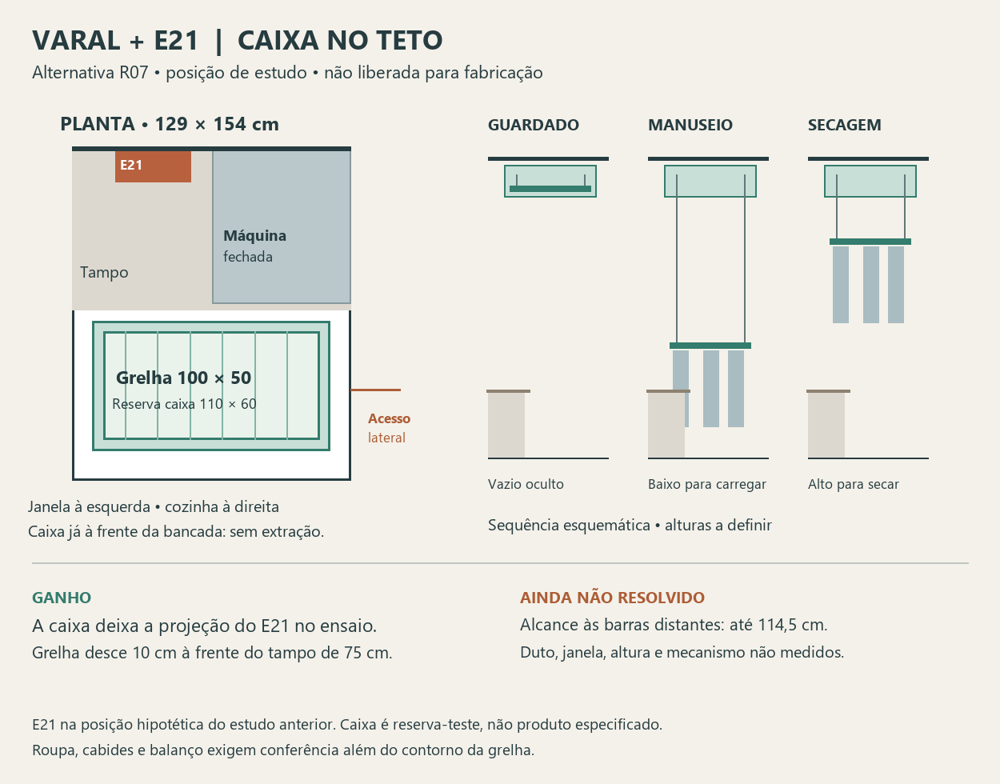

# Varal e E21 — alternativa de caixa no teto, R07

**Superada quanto à ocultação:** Elias considerou a caixa completa exagerada e indicou uma única chapa para bloquear a vista da cozinha. Prosseguir pela [R08 — chapa visual](Varal_chapa_visual_R08.md). Caixa-teste e fechamento inferior abaixo são históricos, não componentes aprovados. Demais cotas e mecanismo continuam hipóteses.

Proposta para avaliação de Elias. Não substitui o funcionamento R05 sem sua escolha e não é projeto de fabricação.

## Proposta concreta

**Manter o E21 na parede técnica e testar a grelha escondida numa caixa no teto já à frente da bancada.** O varal sobe e desce no mesmo lugar: vazio entra na caixa; carregado permanece abaixo dela, alto para secar. A ocultação passa a ser inferior, por testeira/fechamento a detalhar, em vez de depender da extração de um aéreo junto ao aquecedor.

Preservados: grelha 100 × 50 cm, descida à frente da bancada, roupa e conjunto dentro da lavanderia, acesso pelo lado da cozinha e intenção de acabamento Arenza. Mudança proposta: **eliminar a extração horizontal**. Referência de manivela removível mantida para consulta ao fabricante; meta de 30 kg continua a comprovar, não é capacidade aprovada.

## Ensaio geométrico reproduzível

Coordenadas dos estudos R02/R03: x=0 na janela, x=129 no limite com a cozinha; y=0 na parede da bancada, y=154 no limite oposto. Usado o retângulo conservador de 129 × 154 cm. O modelo ilustrativo 3D contém profundidade diferente (161 cm), que não foi adotada para criar folga adicional. E21 permanece na posição **hipotética de comparação** x20–55, y0–15,7; sua posição real e duto não são conhecidos.

| Elemento | Envelope de ensaio, em cm | Natureza da medida |
|---|---|---|
| Grelha | x14,5–114,5; y85–135 | 100 × 50 confirmados; posição nova proposta. |
| Caixa e mecanismo | x9,5–119,5; y80–140 | Reserva-teste de 110 × 60, com 5 cm por lado em planta; não é dimensão conhecida de produto. Se o mecanismo não couber, recalcular. |
| Altura da caixa | Não fixada | Depende de estrutura, forro, fechamento, mecanismo e cotas reais. Não inventar uma espessura rasa como garantia de cabimento. |
| Bancada/máquina fechada | y até 75 / 72 | 75 cm de bancada do modelo e 72 cm de referência instalada da VC4; usar o maior obstáculo. |

Resultados aritméticos do ensaio:

- A borda traseira da grelha fica **10 cm à frente do tampo de 75 cm**, e 13 cm à frente da referência de máquina fechada. A caixa-teste começa 5 cm à frente do tampo, em outra altura.
- Do corpo hipotético do E21 até a grelha: **85 − 15,7 = 69,3 cm**. Até a caixa-teste: **80 − 15,7 = 64,3 cm**. São separações entre projeções, não comprovação de instalação: suporte do E21, duto, ferragens, fechamento e tecidos reduzem ou alteram a folga real. A figura 3 do manual fala em distância frontal ideal acima de 60 cm; os 4,3 cm de diferença no ensaio da caixa não validam o conjunto.
- Restam **19 cm** entre a grelha e o limite oposto (14 cm até a caixa-teste). Isso **não cria passagem frontal para uma pessoa**.
- Sobram 14,5 cm em cada extremidade da grelha e 9,5 cm em cada extremidade da caixa-teste. Estas reservas precisam absorver irregularidades e movimento; não garantem roupa contida, pois cabides e tecidos podem ultrapassar o quadro.

O ganho real é eliminar a trajetória horizontal e o armazenamento na projeção do aquecedor. Não é apenas deslocar para a frente a mesma caixa de extração: o sistema proposto passa a ter movimento exclusivamente vertical e fixação própria à estrutura identificada.

## Três estados propostos

1. **Guardado:** quadro vazio elevado até o compartimento no teto. Conceber fechamento inferior integrado ou independente que efetivamente esconda o quadro visto de baixo; caixa aberta com só uma borda não comprova ocultação. Verificar abertura/trava/manutenção e peso desse fechamento.
2. **Manuseio:** quadro desce verticalmente à frente da bancada; carregamento/retirada pelo lado da cozinha. Altura de trabalho ainda a testar. Máquina permanece fechada durante eventual interferência.
3. **Secagem:** quadro sobe carregado, ficando fora do compartimento. Representar cabides e peça mais longa. Descer para descarregar; recolher na caixa somente vazio.

O ripado do aquecedor é uma peça separada. Esta alternativa não autoriza envolvê-lo num armário raso, cobrir sua base com madeira/isopor, mudar pontos de gás ou obstruir ventilação. Nenhuma ancoragem foi dimensionada.

## O que esta proposta resolve — e o que não resolve

**Avanço demonstrado no ensaio:** a caixa candidata e a grelha não ocupam a projeção do corpo hipotético do E21, e não há mais extração atravessando essa região. A descida passa à frente da bancada de 75 cm sem reduzir a grelha ou avançá-la para a cozinha.

**Ainda falta resolver o alcance.** Pelo limite da cozinha em x129, a extremidade mais próxima fica a 14,5 cm e a mais distante a **114,5 cm**, antes de considerar o afastamento do corpo. Centralizar melhora as reservas de borda, mas piora esse alcance em relação à antiga grelha encostada no limite. Não assumir que baixar mais o quadro resolva. As reservas frontal e laterais não permitem demonstrar que uma pessoa possa contorná-lo.

Mover barras ou suspensões até a borda acessível é uma hipótese para fabricante, não mecanismo já encontrado. Precisa funcionar com toalhas e peças grandes, carga desigual e sem levar roupa/quadro para a cozinha. Não adotar gancho de alcance ou uso só de cabides como substituição silenciosa do programa. Se o fabricante não resolver esse acesso, será necessário rever alguma condição com Elias antes de seguir.

**Também pendentes:** posição real do E21 e trajeto do duto, janela/folhas abertas, sanca, altura da caixa, contenção da roupa com balanço, manutenção, ventilação e dimensionamento de elevação/retenção. A porta da VC4 aberta até y120 intercepta a projeção do varal y85–135; a compatibilidade depende da altura dos tecidos. Não prometer máquina aberta enquanto houver peças longas nessa região.

## Decisão que pode ser tomada agora

Escolher se vale desenvolver **ocultação no teto à frente da bancada**, aceitando eliminar a extração horizontal. É uma alternativa concreta para destravar armazenamento e percurso, mas o conjunto completo ainda não está resolvido. Se escolhida, solicitar ao fabricante estudo do alcance e do mecanismo integrado com essa geometria, e compatibilizar o E21 com o instalador antes de fabricar.

Nenhuma consulta foi enviada a terceiros. R05 permanece como escolha funcional vigente até Elias avaliar esta mudança. Documentação e desenho de estudo apenas; modelo 3D e site não alterados.

Fontes: [revisão documental](Conferencia_documental_lavanderia_2026-09-25.md), [percurso R03](Percurso_varal_R03.md), [alcance R04](Alcance_e_validacao_varal_R04.md), [estados R05](Varal_tres_estados_R05.md), [manual E21, p. 1 e figura 3](../../02_Plantas_e_manuais/Manuais/Rinnai_E21_Manual_176.pdf). Os afastamentos foram conferidos na etapa anterior; este documento não altera os requisitos do fabricante.
