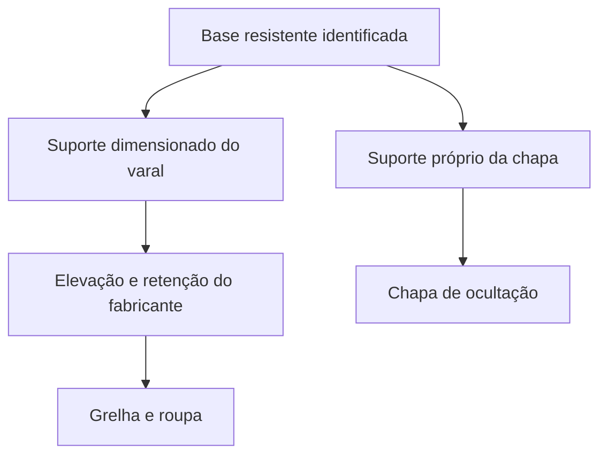

# Varal e chapa — especificação consolidada

Referência atual para detalhamento após aprovação da sequência R10 por Elias. Reúne as escolhas funcionais e os requisitos de mecanismo/instalação, evitando usar como obrigatórias as alternativas históricas de caixa e extração horizontal.

## Escolhas consolidadas

- **Tanque limpo e livre como apoio temporário da roupa retirada da máquina**, escolhido por Elias. Transferir o lote antes de fechar a máquina e pendurar; conferir capacidade e acesso no ensaio. Não exigir recipiente sobre a bancada.

- Grelha de **100 × 50 cm**, inteiramente na lavanderia, com descida à frente da bancada e acesso pelo lado da cozinha.
- Desenvolvimento por **elevação vertical no mesmo lugar**, com quadro vazio elevado para guardar, posição de manuseio e posição alta para secar. Não exigir caixa completa nem extração horizontal.
- **Chapa vertical única** para bloquear a vista habitual da cozinha; Elias aceita que o quadro apareça quando a pessoa se aproxima. Referência visual Arenza, sem material/espessura executivos definidos.
- **Sequência aprovada:** retirar roupa da máquina e fechar a porta → baixar vazio → carregar do fundo para a entrada → sair e subir para secar → baixar e retirar da entrada para o fundo → subir vazio.
- Referência de **manivela removível** preservada; modelo ainda não escolhido. Motor ou varetas individuais não substituem essa referência automaticamente.
- E21 GN com uso em 127 V, LG VC4, tanque/cesto e lixeira mantidos. Chapa e eventual ripado do aquecedor são peças independentes.

## Acionamento: direção de detalhamento

| Item | Requisito para especificar |
|---|---|
| Local de operação | Junto ao acesso pelo lado da cozinha, alcançável de fora da projeção do quadro e com o varal cheio. Não ocupar a passagem com uma manivela permanentemente saliente. |
| Base do comando | Suporte fixo compatível com o mecanismo; não instalar o acionamento numa porta móvel ou presumir que a chapa decorativa sustente o esforço. Parede, altura e fixação a definir após conhecer o produto e as instalações. |
| Parada do quadro | Sistema que mantenha a posição durante carga/descarga sem depender de segurar continuamente a manivela. Retenção e descida controlada devem fazer parte do conjunto fornecido, não de adaptação improvisada. |
| Posições | Identificar manuseio, secagem e recolhimento vazio. A posição de secagem pode ser inferior à de recolhimento, para acomodar tecido/pregadores/cabides. Limites definidos conforme o mecanismo e o espaço real. |
| Percurso de cordas/cabos | Sem atrito na chapa, interferência com abertura de móveis/janela ou aproximação indevida de E21/duto. Representar roldanas e trajetos no desenho; não dimensionar só a grelha. |
| Guarda da manivela | Se removível, prever guarda acessível junto à operação, a detalhar. Não depender de abrir armário bloqueado por roupas ou de alcançar acima do quadro. |
| Capacidade | Meta proposta de 30 kg de roupa molhada continua a comprovar. Solicitar carga útil do conjunto completo e condições de distribuição; não transferir capacidade anunciada para motor a um acionamento manual. |

**Recomendação de desenvolvimento:** quadro convencional sob medida com elevação manual assistida e retenção própria do fabricante. Essa é a família de solução a consultar, não produto já selecionado ou capacidade comprovada. A mudança para chapa reduz a necessidade de um mecanismo combinado com extração, mas não elimina a conferência de alcance e roupa.

## Chapa: fixação e manutenção

Manter a chapa fixa durante o ciclo, aberta por baixo e nas laterais. Seu suporte e o suporte do varal devem ter caminhos de carga próprios até uma base identificada e dimensionada. O forro de gesso, o E21 e seu duto não são suportes presumidos para esses elementos. Não escolher bucha, parafuso, espessura de placa ou ferragem antes de identificar a base e as cargas.

O esquema mostra independência de função, não detalhamento de ancoragem. Permitir remoção técnica da chapa para manutenção, sem fazê-la bascular em cada uso e sem apoiar nela o mecanismo. Verificar cantos, bordo inferior e interferência com a cabeça/mãos na entrada.

Material e acabamento precisam ser apropriados à umidade e ao local real. A referência Arenza não autoriza instalar madeira na base do aquecedor ou dentro de seu volume técnico. Não considerar a chapa proteção antirrespingo ou térmica. Preservar ventilação e manutenção do E21.

## Medidas que permanecem apenas de estudo

| Medida | Referência e limite |
|---|---|
| Setor | 129 × 154 cm da base documental; levantamento acabado pendente. |
| Grelha | 100 × 50 cm escolhidos; dimensões externas de roldanas/suportes adicionais a obter. |
| Manuseio | 190–200 cm sugeridos para ensaio de aproximação por baixo; sem aprovação de altura final. |
| Chapa | Aproximadamente 40–45 cm de queda no exemplo de observação a cerca de 2 m; dependente da altura real dos olhos, teto e recolhimento. Não é cota para corte. |
| Implantação da grelha | x14,5–114,5; y85–135 cm no ensaio R07. Hipótese, não posição executiva. |

## Retorno técnico necessário para fechar o conjunto

Solicitar ao fabricante, numa mesma proposta: identificação do produto; confirmação da grelha 100 × 50; dimensões totais e altura mínima elevada; curso vertical; forma de acionamento e retenção; manivela removível; carga útil e distribuição permitida; materiais e manutenção; requisitos da base e instalação. Comparar a operação aprovada com peça pequena, toalha e peça longa, incluindo entrada, saída e retirada.

O levantamento do apartamento deve localizar pontos do E21, duto, janela, grelhas, sanca/shaft, base estrutural e apoios disponíveis. Compatibilizar os componentes do varal e da chapa com esses elementos e com máquina aberta, recipiente de transferência e lixeira. Não há necessidade de nova escolha estética para obter esses dados.

**Situação:** forma de ocultação e ordem de uso escolhidas. Acionamento e fixação definidos como requisitos para detalhamento, com modelo, cotas e ancoragens ainda dependentes de fabricante/levantamento. Nenhuma compra, mensagem a terceiro, furação ou publicação foi realizada.

Referências: [sequência aprovada R10](Varal_sequencia_de_uso_R10.md), [linha de visão e pesquisa R09](Varal_linha_de_visao_e_mecanismo_R09.md), [chapa R08](Varal_chapa_visual_R08.md), [conferência documental](Conferencia_documental_lavanderia_2026-09-25.md).
