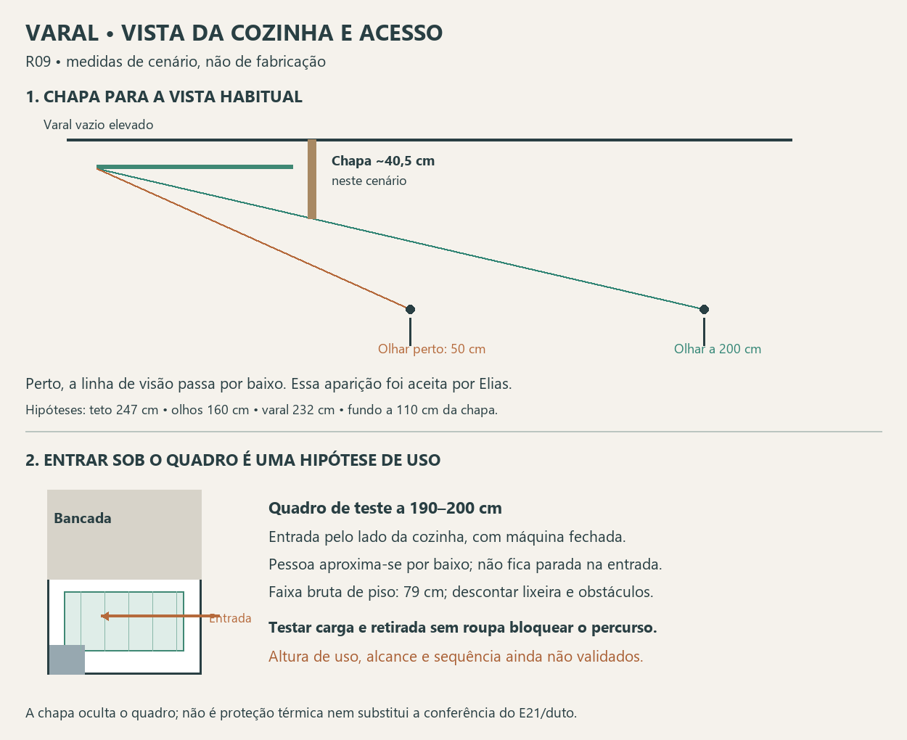

# Varal — linha de visão, alcance e mecanismo, R09

Continuidade autorizada por Elias após a escolha de chapa visual em lugar de caixa completa. A R08 permanece como direção estética. Esta revisão testa a ocultação e atualiza a pesquisa de mecanismos sem aprovar dimensões de fabricação.

## 1. A chapa precisa ser dimensionada pela vista

Para tornar a comparação concreta, adotou-se **somente como cenário**: teto a 247 cm, olhos a 160 cm, ponto mais baixo do varal vazio recolhido a 232 cm e extremidade mais distante a 110 cm atrás da chapa. Não são medições do apartamento, da altura dos olhos de Elias ou de um mecanismo escolhido. Os 110 cm simplificam a distância da chapa ao fundo da grelha no ensaio anterior, não são largura de caixa.

| Distância horizontal da pessoa à chapa | Altura mínima geométrica da chapa a partir do teto, neste cenário |
|---|---:|
| 50 cm | 64,5 cm |
| 100 cm | 52,7 cm |
| 150 cm | 45,5 cm |
| 200 cm | 40,5 cm |
| 250 cm | 37,0 cm |

A conta mostra por que uma faixa de 20–30 cm não pode ser prometida como ocultação integral. Neste cenário específico, uma chapa de 30 cm só bloquearia o raio até a extremidade distante a partir de cerca de 418 cm de distância. Elevar o quadro mais perto do teto melhora a conta, mas ainda depende do espaço ocupado por roldanas e fixações.

**Critério escolhido por Elias nesta revisão:** priorizar a vista habitual de uso da cozinha e admitir que o quadro apareça ao chegar junto à lavanderia. Não exigir ocultação integral na entrada. Uma chapa na faixa de 40–45 cm pode ser comparada no cenário ilustrativo de observação a cerca de 2 m, sem transformar esses números em dimensões aprovadas. A posição habitual real, teto e recolhimento do produto definirão a medida.

O corte testa apenas a vista alinhada. Largura da chapa precisa de vistas oblíquas em planta; não encomendar uma chapa de 50 cm só porque a extremidade da grelha mede 50 cm. Suportes e cordas que ficarem fora do volume ocultado precisam aparecer no próximo desenho.

### Memória do cálculo

Se H é teto, E a altura dos olhos, Z a altura do ponto-alvo, a a distância horizontal observador–chapa e b a distância chapa–alvo, o raio cruza a chapa em `z = E + (Z − E) × a / (a + b)`. Uma chapa que parte do teto precisa ter queda de pelo menos `H − z`, antes de tolerâncias. A posição relevante é o ponto visível que exigir o bordo inferior mais baixo. Isso calcula ocultação visual, não passagem sob a chapa ou afastamento técnico do aquecedor.

## 2. Acionamento e acesso são problemas diferentes

A pesquisa confirma oferta de elevação convencional por manivela e de varetas que descem individualmente. **Nenhum desses recursos, por si, aproxima os pontos de carga da pessoa.** Não selecionar um produto só porque a grelha ou o movimento vertical parecem adequados.

| Solução encontrada | Evidência consultada | Consequência para este projeto |
|---|---|---|
| Quadro convencional com manivela | O Meu Varal anuncia movimento do conjunto inteiro e fabricação sob medida; larguras padrão 60/70/80 cm. | Candidato para solicitar 100 × 50 cm. Preserva referência de manivela; capacidade, altura recolhida e retirada da manivela precisam de confirmação. |
| Motorização do quadro | O Meu Varal anuncia até 30 kg para a opção motorizada. | Não transferir essa capacidade à manivela ou a um quadro específico. Motor não foi escolhido e não resolve alcance horizontal. |
| Varetas individuais de 100 × 50 cm | Guedes Varais lista essa medida com seis varetas e descida individual. | Medida disponível é dado útil, mas muda o funcionamento do quadro e não comprova carga total de 30 kg ou acesso aos pontos distantes. Não adotado. |
| Varetas individuais sob medida | Tecvaral descreve movimentação vertical por vareta e uso de haste auxiliar no comando. | Haste para comandar o varal não é prova de que se consiga distribuir toalhas ou peças grandes à distância. Não adotado como solução de alcance. |

Fontes primárias consultadas nesta revisão: [O Meu Varal](https://omeuvaral.com.br/varal-de-teto/), [Guedes Varais](https://www.guedesvarais.com.br/varal-individual.html), [Tecvaral](https://tecvaral.com.br/varal-individual/). São informações comerciais dos fornecedores, sem ensaio independente. Nenhuma mensagem enviada ou compra realizada.

## 3. Teste geométrico do acesso

Na implantação candidata R07, a pessoa pelo limite da cozinha x129 tem a extremidade próxima em x114,5 e a distante em x14,5: são **14,5 a 114,5 cm**, antes do afastamento do corpo. Baixar todo o quadro ou cada vareta não altera essas distâncias horizontais.

Deslocar a grelha para a cozinha até a borda x129 reduziria o alcance extremo a 100 cm, mas consumiria a reserva de contenção de cabides/tecidos. Não fazer essa alteração silenciosamente. Girar toda a grelha em 90° para aproximar a borda longa voltaria à profundidade de 100 cm: `75 + 100 = 175 cm` antes de folga, maior que os 154 cm do estudo. Esse giro não cabe para descida integral à frente do tampo nesta base.

### Hipótese nova: aproximar-se por baixo do quadro elevado

**Correção da premissa anterior:** o alcance de 114,5 cm se aplica à pessoa parada na entrada, fora da projeção do varal. Não demonstra impossibilidade de uso por alguém que entre na lavanderia sob o quadro. A faixa de 19 cm além da grelha também não representa toda a área de piso disponível quando o quadro está acima da cabeça.

Com a máquina fechada e tampo até y75, existe faixa bruta de piso de **154 − 75 = 79 cm** diante da bancada, ao longo dos 129 cm. Parte dessa faixa fica sob o varal, podendo ser usada para aproximação se houver altura livre. Lixeira e demais objetos precisam ser descontados; não são 79 cm livres garantidos em toda a extensão.

**Ensaio proposto:** descer o quadro até aproximadamente 190–200 cm do piso, em vez de colocá-lo à frente do rosto/peito. Para a estatura registrada de Elias, 175 cm, seriam 15–25 cm nominais acima da cabeça, antes de calçado, espessuras e ferragens abaixo do quadro. Não é uma altura ergonômica validada: testar se permite entrar sem contato e manipular roupa/pregadores sem esforço excessivo.

Entrar pelo lado da cozinha, aproximar-se das posições distantes sob o quadro e carregar primeiro as posições que depois ficariam menos acessíveis. Recuar em direção à saída conforme a roupa for ocupando o espaço; na retirada, liberar primeiro o acesso. Esse é um procedimento candidato para teste, não promessa de que qualquer toalha ou lençol permita a passagem: tecidos longos/largos podem formar uma barreira, e a orientação das barras precisa aparecer no ensaio.

Essa hipótese preserva o acesso pelo lado da cozinha, movimento vertical, grelha de 100 × 50 cm e permanência no setor. Não exige trazer a grelha para a cozinha nem subir em móveis. Se a altura acima da cabeça for desconfortável para carga ou as roupas bloquearem a operação, a solução continua pendente; não inferir sucesso apenas pela planta.

Próxima comprovação de uso deve demonstrar colocação e retirada de peça pequena, toalha e peça longa, com máquina fechada, lixeira no lugar e pessoa aproximando-se sob o quadro. Pode ser ensaio em escala real fora do apartamento usando o mesmo retângulo e obstáculos simulados; não exige acesso à unidade, mas não substitui o levantamento de instalação. Não assumir cabides como único uso.

Não foi encontrado nesta pesquisa um mecanismo comercial comprovado que traga as barras distantes à borda de carga sem alterar os demais requisitos. Isso não prova inexistência. Permanece necessário demonstrar esse acesso antes de fechar a posição do quadro. A pesquisa foi limitada às fontes listadas.

## 4. O que fica encaminhado

- **Ocultação:** chapa única voltada à cozinha, independente do quadro; sem caixa e sem fechamento inferior. Vista habitual da cozinha escolhida; pode aparecer ao chegar perto. Altura ainda a dimensionar.
- **Elevação:** prosseguir com a referência de manivela para o estudo vertical, sem selecionar motor ou varetas individuais automaticamente. Mecanismo sem compra ou especificação executiva.
- **Escopo atualizado para futura consulta:** pedir quadro 100 × 50, dimensões totais do mecanismo, altura mínima recolhida, curso vertical, acionamento/manivela removível, capacidade útil com distribuição desigual, demonstração do acesso integral e fixação compatível com suporte identificado. Não pedir mais caixa completa ou extração horizontal como solução obrigatória da nova direção.
- **Aquecedor:** preservar os requisitos já registrados de ventilação, acesso e separação. A chapa não é proteção térmica nem antirrespingo. Posição final depende dos pontos e do duto; não foi alterada nesta revisão.

Esta etapa define o critério de ocultação, identifica uma hipótese de acesso por baixo do quadro e evita escolher um acionamento como se ele resolvesse sozinho o alcance. Conjunto ainda não liberado para fabricação; preferências consolidadas são mantidas.

Referências locais: [chapa R08](Varal_chapa_visual_R08.md), [ensaio R07](Varal_caixa_no_teto_R07.md), [pesquisa anterior R06](Mecanismos_e_fornecedores_R06.md), [alcance R04](Alcance_e_validacao_varal_R04.md).
