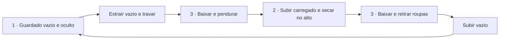

# Varal oculto elevatório — três estados

13/09/2026 · F116 · Conceito funcional atualizado, sem liberação para fabricação.

Esta revisão passa a ser a referência de funcionamento. Os ensaios R02–R04 permanecem como verificações de geometria, mas não representam a secagem habitual com o varal baixado.

## Escolhas confirmadas

Grelha100 ×50 cm, todo o conjunto e roupas dentro da lavanderia. Vazio fica guardado fora da visão; durante a secagem fica alto e carregado; baixa para pendurar/retirar roupas à frente da bancada, com acesso pelo lado da cozinha. A meta30 kg molhados permanece requisito proposto a comprovar, além do peso próprio. Referência anterior de manivela removível preservada; mencionar o varal de corda atual não definiu troca de acionamento.

## Organização proposta

Separar o movimento horizontal de guardar do movimento vertical de uso. A caixa guarda somente o quadro vazio. O conjunto extraído oferece uma posição vertical alta para secagem e uma baixa para manuseio. Nenhuma altura, curso ou tipo de ferragem está aprovado.

| Estado | Posição do quadro | Roupa | Condição visual e funcional |
|---|---|---|---|
| 1. Guardado | Alto, recolhido na caixa | Vazio | Testeira Arenza oculta quadro e mecanismo; acesso de manutenção previsto. |
| 2. Secando | Alto, fora da caixa | Carregado | Roupa livre para secar. Permanecer extraído é a proposta de mecanismo, a compatibilizar com o espaço. |
| 3. Manuseio | Baixo, à frente da bancada | Carregando/descarregando | Acesso lateral aceito; alcance de todas as barras ainda a verificar. |

A grelha não é recolhida com roupas para dentro da caixa. Isso evita tratar a ocultação como etapa da secagem e reduz o número de percursos carregados junto ao móvel. Não comprova, sozinho, distância adequada do E21.

## Requisitos do mecanismo a detalhar

1. **Extração horizontal vazia:** conjunto portante leva a grelha além da maior projeção real da bancada/máquina, com margem a determinar. Curso depende da posição da caixa; não fixar automaticamente72 ou85 cm.
2. **Travamento na posição extraída:** propor retenção que impeça recolhimento involuntário enquanto a grelha estiver baixada ou em secagem. Destravamento para guardar somente após retirada da roupa e subida do quadro, como requisito funcional do futuro mecanismo.
3. **Elevação/descida carregada:** acionamento assistido e retenção contra descida descontrolada, considerando quadro, suspensão e roupa molhada desigual. Não escolher cabo, roldana ou redutor sem cálculo.
4. **Estabilidade:** controlar inclinação e balanço; não presumir que quatro cabos soltos mantenham a grelha nivelada sob carga desigual.
5. **Estrutura:** suporte próprio identificado e dimensionado. Testeira é acabamento, não caminho de carga. Não fixar ao aquecedor, duto ou apenas ao forro/painel decorativo.

Esses itens são especificação de desempenho; não representam produto comercial encontrado ou mecanismo certificado.

## Corte vertical: o que muda com a secagem alta

Definir Hs como altura da barra em secagem; Hb como altura para manuseio; L como comprimento pendurado total, incluindo cabide; O como altura de qualquer obstáculo sob a roupa; m como margem de movimento. A barra baixa sobe um curso Hs−Hb. Para tecido não tocar um obstáculo, é necessário verificar **Hs−L > O+m**. Não foram atribuídos valores executivos a essas variáveis.

Portanto, elevar o quadro pode liberar a frente da máquina durante parte da secagem, mas isso depende do comprimento das peças. Uma toalha ou cobertor pode continuar bloqueando acesso mesmo com o quadro alto. No estado baixo, o bloqueio é temporário para pendurar/retirar, não permanente durante a secagem.

Comparar três volumes diferentes no corte: caixa vazia recolhida, quadro alto com a roupa mais longa, e quadro baixo com essa roupa. Acrescentar duto e volume do E21 em toda a trajetória. Usar a altura final2,47 m apenas como cenário anterior, não levantamento de instalação; sanca, forro e suporte podem reduzir o espaço.

## Implantação e água

Prossegue a orientação candidata100 cm paralelos à bancada,50 cm em profundidade. A alternativa girada com extração reta permanece incompatível com o ensaio R02/F111. O estado alto carregado não elimina conflito em planta: roupa ocupa projeção e pode balançar. Manter toda a roupa na lavanderia, sem projetar para cozinha.

Não posicionar secagem sobre o aquecedor. Evitar que o volume das peças, inclusive balanço e gotas durante subida/descida, alcance E21/duto. Não adicionar bandeja ou divisória próxima ao aparelho como solução automática: ambas precisam de compatibilização de peso, movimento, calor e ventilação.

## Ripado e testeira são peças distintas

A testeira Arenza do varal oculta o conjunto vazio e acompanha a solução da caixa. O ripado do E21 tem função de ocultar o aparelho e precisa preservar sua instalação. Não unificar as duas frentes antes do corte: abrir uma não deve movimentar a outra, atingir roupa ou bloquear acesso ao aquecedor. Dimensões, material do ripado e afastamento frontal ainda não definidos.

## Resultado desta revisão

Funcionamento dos três estados fechado com Elias. Proposta de dois movimentos independentes e recolhimento somente vazio consolidada para detalhamento; mecanismo ainda não escolhido. Recolhimento da caixa junto ao E21/duto, alcance das barras distantes e cotas verticais reais continuam pendentes. A nova descrição corrige a interpretação de uso, mas não comprova encaixe físico. Próximo levantamento técnico deve representar os três estados deste documento, sem reabrir preferências já respondidas.
