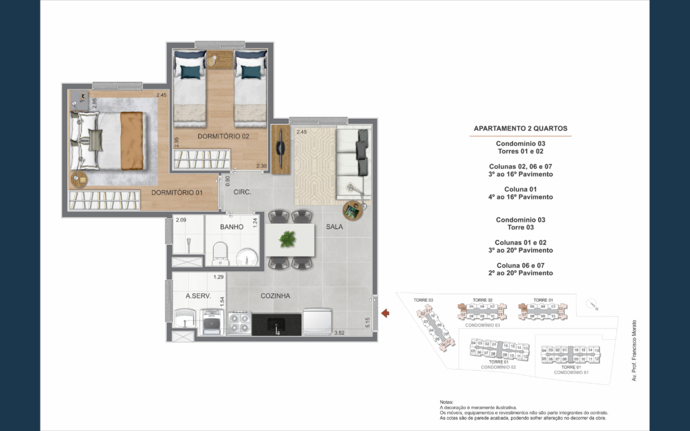
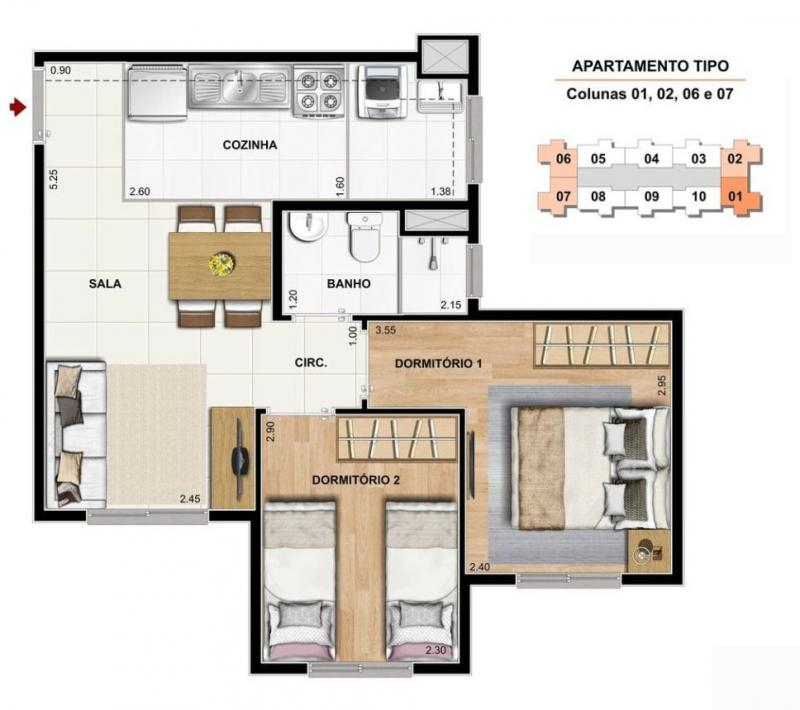
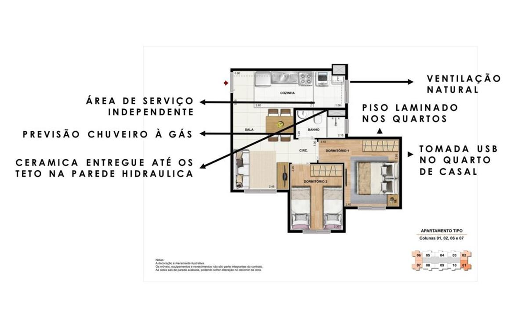
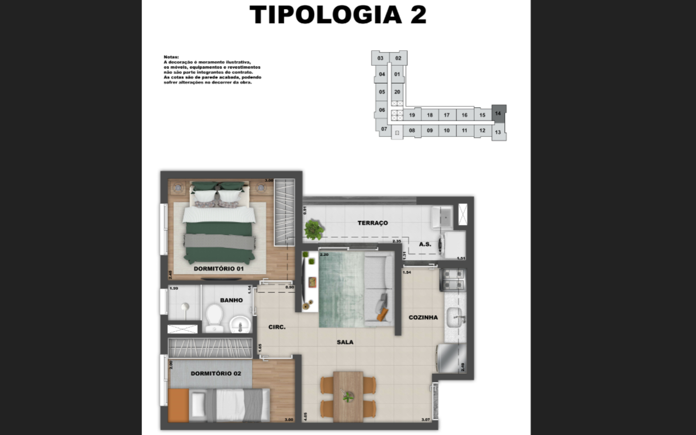
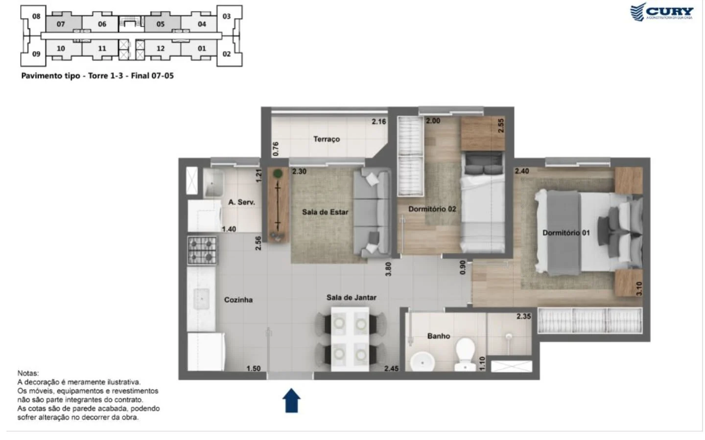

# Pesquisa comparativa Cury: apartamento de canto de 40,18 m²

**Atualização F101 — 12/09/2026:** memorial oficial recebido após esta pesquisa. Para entrega e instalações, consultar [análise vigente](../Memorial_Cury_entrega_e_impactos.md). A pendência de obtê-lo está encerrada; a proibição de ar-condicionado e a infraestrutura de gás para chuveiro estão documentadas. O texto abaixo e o PDF preservam a pesquisa anterior; altura e plantas técnicas permanecem pendentes.

Pesquisa em 12/09/2026. Referência: Guedala Park III / Premium, Torre 02, final 06, 8º andar, conforme o projeto existente.

## O que a pesquisa esclareceu

A melhor referência encontrada é uma planta adicional da própria Cury para o Guedala Park Premium. Ela reúne a configuração do seu apartamento e identifica outros finais onde procurar fotos e vídeos equivalentes. Há também uma família de plantas de ponta em Vila das Belezas / João Dias muito próxima da sua.

Não localizei outro empreendimento da Cury com exatamente 40,18 m² e equivalência de planta comprovada. Localizei áreas próximas e desenhos úteis, mas nenhuma dessas fontes substitui a documentação da sua unidade.

| Referência | Área publicada | Utilidade para você |
| --- | --- | --- |
| Guedala Park III / Premium | 40,18 m² | Mesma tipologia; fonte prioritária. |
| Dez Canindé | 40,20 m² (+0,02) | Área quase igual; não foi possível vincular os 40,20 a uma imagem específica da galeria. |
| Cidade Mooca - Vila Sardenha | 40,13 m² (-0,05) | Área próxima; comercialização com terraço e desenhos diferentes. |
| Cury João Dias / Vila das Belezas | 40,68 m² (+0,50) | Desenho de ponta muito semelhante; nomes e fases exigem cuidado. |

Para prever distribuição e proporções, a semelhança geométrica ajuda mais do que uma diferença mínima na área total. Para prever acabamentos, instalações e altura, é necessário o documento do seu empreendimento e do seu final.

Critério usado: planta da unidade fornecida no projeto; imagens oficiais da Cury; livros comerciais; acervos de corretores; memorial técnico de outro empreendimento; pesquisa acadêmica. Os resultados abaixo distinguem comprovação direta, comparação e informação ainda ausente.

Referências [1]-[8], detalhadas no índice de fontes. Data de consulta: 12/09/2026. Este relatório não altera as medidas nem as decisões já registradas no projeto.

## 1. Outros apartamentos do seu tipo

Imagem original da Cury: Guedala Park Premium, Condomínio 03 [1]. Cotas e mobiliário apresentados em planta comercial.

| Condomínio 03 | Finais / colunas | Pavimentos da imagem |
| --- | --- | --- |
| Torres 01 e 02 | 02, 06 e 07 | 3º ao 16º |
| Torres 01 e 02 | 01 | 4º ao 16º |
| Torre 03 | 01 e 02 | 3º ao 20º |
| Torre 03 | 06 e 07 | 2º ao 20º |

Esse mapa permite direcionar a busca por registros de moradores para finais 01, 02, 06 e 07 do Condomínio 03, observando torre e andar. Algumas unidades são espelhadas; fachadas e orientação solar variam.

Sua planta contratual identifica Torre 02, final 06, do 4º ao 16º; a imagem comercial inclui o 3º nessa coluna. O seu 8º andar está nas duas faixas. A informação comercial não amplia a validade do documento da unidade.

## 2. O que já sabemos do seu interior

As cotas abaixo vêm da planta oficial já presente no seu projeto [U1]. A planta encontrada na internet repete as principais proporções. São medidas de projeto, ainda sem conferência presencial no apartamento acabado.

| Ambiente / trecho | Cota da sua planta | Leitura prática |
| --- | --- | --- |
| Dormitório 01 | 2,45 × 2,95 m | Retângulo principal do quarto; o recuo de acesso tem geometria própria. |
| Dormitório 02 / escritório | 2,30 × 2,95 m | Base mais confiável para estudar bancada, armário e cama de hóspedes. |
| Banheiro | 2,09 × 1,24 m | Janela lateral junto ao box; atenção ao enchimento técnico. |
| Cozinha | 3,52 × 1,55 m | Cota longitudinal do setor; não significa 3,52 m livres para armários. |
| Lavanderia | 1,29 × 1,54 m | 1,29 paralelo à bancada; 1,54 no sentido transversal. Janela lateral própria. |
| Sala | 2,45 m de largura | A cota maior de 5,15 m atravessa o conjunto sala/cozinha. |
| Circulação | 0,90 m e 1,05 m | Cotas em eixos distintos; não representam um único corredor de largura constante. |

O que muda no planejamento: a largura da sala não é a largura da janela; a cota da cozinha não é o comprimento útil de bancada; os retângulos dos quartos não incluem automaticamente folgas de portas, armários e rodapés.

Como exercício de proporção, uma cama de 1,58 m em uma largura de 2,45 m deixaria 0,87 m no total para os dois lados, antes de qualquer interferência. Isso não aprova uma disposição: apenas mostra por que alguns centímetros fazem diferença.

A planta também distingue paredes estruturais, trechos de gesso e enchimentos técnicos. Não permite concluir que um volume possa ser removido ou que uma instalação possa mudar de posição.

[U1] 02_Plantas_e_manuais/Planta_oficial.pdf. A interpretação dimensional complementa os estudos existentes em 01_Projeto/Medidas; não libera fabricação.

## 3. A comparação mais parecida

Planta de ponta publicada no acervo “Cury Dez João Dias” da JM Marques [4]. Esta imagem não escreve a área total.

O desenho mantém sala ao lado dos quartos, cozinha transversal na entrada, banheiro central e lavanderia na extremidade. Ao girá-lo 180°, a organização fica muito próxima da sua. As colunas destacadas são 01, 02, 06 e 07.

| Cota | Seu Guedala | Planta comparada |
| --- | --- | --- |
| Quarto 01, retângulo principal | 2,45 × 2,95 m | 2,40 × 2,95 m |
| Quarto 02 | 2,30 × 2,95 m | 2,30 × 2,90 m |
| Banheiro | 2,09 × 1,24 m | 2,15 × 1,20 m |

Um anúncio “Cury João Dias” apresenta desenho semelhante como 40,68 m² [3]; outro o chama “Vila das Belezas” [5]. O acervo [4] ainda contém fachada com nome de outra fase. Por isso, não trato todos os nomes como um único empreendimento nem atribuo automaticamente 40,68 m² à imagem cotada acima.

## 4. Detalhes encontrados nessa família

Material de divulgação “Cury Vila das Belezas”, identificado como planta de ponta [5].

A imagem destaca ventilação natural, área de serviço independente, previsão de chuveiro a gás, piso laminado nos quartos, cerâmica até o teto na parede hidráulica e tomada USB no quarto de casal.

O que pode ser aproveitado: a relação entre cozinha, tanque, janela, banho e quartos ajuda a reconhecer vídeos de uma configuração semelhante. A indicação de área de serviço independente descreve uma posição setorizada; não basta para concluir que exista porta separando a cozinha.

O que não pode ser transferido: chuveiro a gás, tomada USB, extensão dos revestimentos e materiais são promessas desse material comercial, não confirmações de entrega no Guedala. Mesmo em desenhos semelhantes, essas especificações podem mudar.

A semelhança observada é de organização e medidas aproximadas. Ela não demonstra igualdade de shafts, tubulações, espessuras de parede, esquadrias ou altura do teto.

A publicação [3] registra 40,68 m² em uma planta visualmente semelhante. A identificação da fase permanece uma limitação; as imagens foram preservadas com seus nomes de origem.

## 5. Áreas quase iguais, plantas diferentes

Vila Sardenha: 40,13 m². Anúncios associam essa metragem a dois dormitórios e terraço [6, 6b]. A galeria oficial contém vários tipos [7]; a imagem abaixo é um exemplo, sem área total impressa, e não uma identificação definitiva da unidade de 40,13 m².

Exemplo da galeria oficial de Vila Sardenha [7]. Não usar suas cotas como medidas do Guedala.

Dez Canindé: 40,20 m². O acervo comercial informa essa área entre outras opções [8]. A Cury publica plantas com e sem terraço [9]. Não encontrei vínculo inequívoco entre a área de 40,20 m² e uma imagem específica.

Exemplo oficial do Canindé: planta com terraço, finais 05 e 07 das torres 01 e 03 [9]. A imagem não informa 40,20 m².

Essas referências demonstram o limite da busca por área: diferenças de terraço, circulação e formato dos quartos podem alterar bastante o uso de um apartamento de aproximadamente 40 m².

## 6. Entrega, teto e instalações

Pé-direito: continua sem confirmação documental para sua unidade. Não localizei corte do Guedala ou tabela de alturas por ambiente. As hipóteses anteriores de 2,57 m e de 2,47 m após um rebaixo de 10 cm continuam sendo cenários de estudo; esta pesquisa não as validou.

Ar-condicionado: o book do Guedala informa ausência de previsão de carga elétrica para instalação nos apartamentos [2]. Isso é uma limitação concreta para planejamento, mas o texto não demonstra, sozinho, qual intervenção futura seria autorizada. É necessário verificar memorial, projeto elétrico e regras aplicáveis à sua unidade.

Acabamentos: o arquivo local “Memorial_do_apartamento_v2.pdf” registra decisões do seu projeto de interiores. Ele não é o memorial descritivo de entrega emitido pela Cury.

Um memorial real: My Miguel Yunes

Encontrei um memorial Cury de 25/02/2022 [10]. Ele diferencia pisos por ambiente e prevê forro de gesso no banheiro. Mais decisivo: especifica água quente a gás apenas para determinados finais; os demais recebem previsão de chuveiro elétrico. Também registra limitações próprias para ar-condicionado e coifa.

Esse documento é útil para demonstrar quais informações devem ser procuradas. Ele não define a entrega do Guedala: até dentro de um empreendimento a infraestrutura pode variar conforme o final.

O que ainda falta comprovar

Altura livre em cada ambiente; rebaixos e sancas; dimensões e peitoris das janelas; posição exata de tomadas e tubulações; circuitos disponíveis; condições de água quente; material e extensão dos revestimentos; dimensões acabadas dos enchimentos técnicos.

[2] Book Guedala Park III, abril/2023. [10] Memorial My Miguel Yunes, R01, pp. 10-11 e 15-17. O documento de outro empreendimento é somente comparativo. Não foi encontrado um novo documento que resolva o pé-direito do Guedala.

## 7. Como obter as respostas que faltam

A próxima fonte decisiva é a documentação da Torre 02, final 06, 8º andar. Fotos de finais equivalentes ajudam a antecipar aparência e volumes; dimensões e condições de instalação precisam corresponder à sua unidade.

| Documento a solicitar | Dúvida que resolve |
| --- | --- |
| Memorial descritivo contratual e eventuais revisões | Pisos, paredes, louças, metais, forros e equipamentos previstos na entrega. |
| Planta de arquitetura cotada, cortes e detalhe de forros | Pé-direito, vigas, sancas, rebaixos, enchimentos e dimensões finais. |
| Quadro / detalhes de esquadrias | Largura e altura das janelas, peitoris e tipo de abertura. |
| Plantas elétrica, hidráulica, gás e esgoto da unidade | Pontos, circuitos, cargas, água quente e trajetos previstos. |
| Manual do proprietário e as built, quando disponíveis | Sistemas efetivamente executados e orientações de uso e intervenção. |

Texto preparado para a Cury

Sou proprietário de uma unidade do Guedala Park III / Premium, Torre 02, final 06, 8º andar, com 40,18 m² e planta de canto. Solicito o memorial descritivo de entrega correspondente à minha unidade, a planta cotada de arquitetura, cortes ou informação formal de pé-direito por ambiente, planta de forros e detalhes de esquadrias. Solicito também as plantas de instalações disponíveis para o meu final. Preciso confirmar rebaixos, janelas e peitoris, pontos de água e esgoto, água quente, circuitos e previsão de carga para ar-condicionado, além dos revestimentos que serão entregues. Se os documentos finais ainda não estiverem disponíveis, peço a revisão vigente e a indicação do que ainda poderá mudar.

Mensagem preparada, não enviada. Documentos de execução ou as built podem depender da fase da obra. O pedido não pressupõe que todos já estejam disponíveis.

Para novas imagens, priorize buscas com “Guedala Park III final 06”, “Guedala Premium torre 2 canto” e os finais equivalentes do Condomínio 03 listados neste relatório. O site oficial também apresenta um vídeo como tour [11], mas sua correspondência com o final 06 não foi verificada.

## Fontes e rastreabilidade

- [1] [Cury - Guedala Park Premium; imagem oficial da tipologia do Condomínio 03](https://cury.net/storage/images/products/plants/642c90a978dd7.jpeg)

- [2] [Book Guedala Park III, abril/2023; tipologias na p. 22 e observações finais](https://www.guerato.com.br/_files/ugd/1d445c_9f2918bdea3e4ea1a33d4b71ed346bc9.pdf)

- [3] [Imóvel App - Cury João Dias; planta divulgada como 40,68 m²](https://www.imovelapp.com.br/imovel/cury-joao-dias/)

- [4] [JM Marques - acervo “Cury Dez João Dias”; identificação de fase inconsistente](https://www.jmmarques.com.br/pagina/empreendimento/cury-dez-joao-dias=1373)

- [5] [Terrara Interlagos - Cury Vila das Belezas; imagens “ponta” e “meio”](https://terrarainterlagos.com.br/cury-vila-das-belezas/)

- [6] [JM Marques - Vila Sardenha; faixa publicada de 34,51 a 40,13 m²](https://www.jmmarques.com.br/pagina/empreendimento/cury-cidade-mooca-vila-sardenha=1823)

- [6b] [Na Varanda com Prisma - Cidade Mooca, parte 1; associação 40,13 m² e terraço](https://navarandacomprisma.com.br/cidade-mooca-parte-1-cury/)

- [7] [Cury - Cidade Mooca Vila Sardenha; galeria oficial de plantas](https://cury.net/imovel/SP/zona-leste/cidade-mooca-vila-sardenha)

- [8] [JM Marques - Dez Cury Canindé; áreas publicadas, incluindo 40,20 m²](https://www.jmmarques.com.br/pagina/empreendimento/dez-cury-caninde=1497)

- [9] [Cury - Dez Canindé; galeria oficial de plantas](https://cury.net/imovel/SP/zona-norte/dez-caninde)

- [10] [Cury - My Miguel Yunes, memorial de vendas R01, 25/02/2022](https://static.orulo.com.br/files/properties/original/538704.pdf)

- [11] [Vídeo apresentado como tour na página oficial do Guedala; não analisado](https://www.youtube.com/watch?v=Bl2ayPHnf28)

- [12] [Toyoda, Thayna R. L. - Procedimentos adotados pelas incorporadoras para definição das plantas de moradias de dois dormitórios em São Paulo e a explosão dos HIS. USP, 2024; repositório 2025, p. 168](https://www.teses.usp.br/teses/disponiveis/16/16132/tde-02072025-113738/publico/METhaynaRigoldiLeandroToyoda_Rev.pdf)

A página oficial do Guedala usada na pesquisa está em cury.net/imovel/SP/zona-sul/guedala-park-premium. [U1] é a planta local fornecida no projeto. As principais imagens e PDFs foram preservados na pasta fontes. Referências de terceiros foram usadas para localizar áreas e desenhos, sem validar anúncios de preço, prazo ou financiamento.

A dissertação [12] foi consultada como contexto sobre famílias de plantas de Cury, incluindo Urban Tatuapé e Sardenha; não comprova equivalência com o Guedala. Também foram rastreados catálogos e anúncios com 40,18 / 40,13 / 40,20 / 40,68 m². Ausência de confirmação nesta pesquisa não demonstra inexistência de outro produto com 40,18 m².
