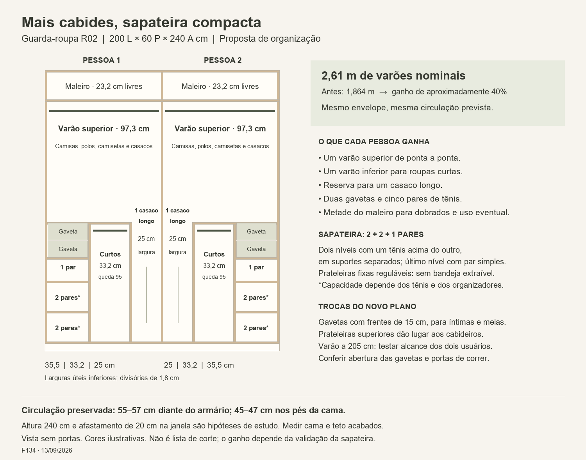

# Guarda-roupa — organização interna R02

**Plano aprovado por Elias — F135, 13/09/2026.** R02 salva como organização interna escolhida, com envelope de referência 200 × 60 × 240 cm, divisão igual, quatro gavetas, dez pares de tênis previstos e dois casacos longos. As conferências de medidas reais, ferragens, alcance e tênis descritas neste documento permanecem etapas de detalhamento para execução, não pendência de aprovação do plano. **O dormitório não terá TV.**

13/09/2026 · F134 · Nova proposta solicitada por Elias.

[Imagem ampliada](Guarda_roupa_interior_R02.png) · [Desenho vetorial](Guarda_roupa_interior_R02.svg) · [Histórico](Guarda_roupa_R00.md)

## Proposta

Manter o envelope de estudo **200 × 60 × 240 cm (largura × profundidade total × altura)** e duas metades espelhadas. Compactar sapatos e gavetas na parte inferior das extremidades e eliminar as divisórias altas dessas colunas. Assim, o varão superior passa a atravessar toda a largura útil de cada metade.

A prioridade é roupas penduradas: camisas, camisetas, polos, calças dobradas no cabide e casacos. Preservar quatro gavetas, dez pares de tênis até numeração 42, pequena reserva para dois casacos longos e metade da capacidade para cada pessoa. Cinco pares por lado e um casaco longo por lado são distribuição proposta para atender à divisão igual.

Este plano substitui R01 como proposta vigente, sem transformar cotas de estudo em medidas aprovadas para fabricação.

## Comparação com R01/F133

| Aspecto | R01 | R02 |
|---|---|---|
| Varão superior por pessoa | 60 cm | 97,3 cm |
| Varão inferior por pessoa | 33,2 cm | 33,2 cm |
| Comprimento nominal total de varões | 186,4 cm | **261 cm: +74,6 cm, cerca de 40%** |
| Reserva para casacos longos | Um vão de 25 cm por lado | Mantida |
| Sapateira por pessoa | Cinco níveis de um par | Três níveis: 2 + 2 + 1 pares, condicionado ao teste |
| Faixa vertical da sapateira | 8 a 108 cm | 8 a 80 cm: redução proposta de 28 cm |
| Gavetas | Duas por pessoa, frentes próximas de 20 cm | Duas por pessoa, frentes próximas de 15 cm |
| Dobrado acima das gavetas | Prateleiras dedicadas | Área convertida em cabides; dobrados no maleiro e gavetas conforme volume |
| Tamanho externo e circulação | Envelope de estudo | Mantidos |

O ganho de 40% é comprimento geométrico dos varões antes dos suportes, não aumento comprovado de 40% na quantidade de roupas nem no volume total do armário. Há uma troca explícita: gavetas mais baixas e menos prateleiras dedicadas para dobrados permitem mais cabides. Não é alegação de solução universalmente mais eficiente.

## Divisão horizontal

Painéis de 18 mm são hipótese de cálculo. Cada metade tem 97,3 cm úteis. Na base:

- Coluna externa: 35,5 cm úteis para sapatos e gavetas.
- Divisória parcial: 1,8 cm.
- Cabideiro inferior para peças curtas: 33,2 cm úteis.
- Divisória parcial: 1,8 cm.
- Vão central para um casaco longo: 25 cm úteis.

Conta: 35,5 + 1,8 + 33,2 + 1,8 + 25 = 97,3 cm. Total externo: 2 × 97,3 + 3 × 1,8 = 200 cm. As metades são espelhadas. As divisórias inferiores terminam na altura de 110 cm; o varão superior tem 97,3 cm nominais por lado.

As roupas longas usam os 25 cm do varão superior sobre o vão livre; não somar essa reserva novamente à capacidade. O varão superior é fixo nesta proposta. Verificar suportes, carga e eventual apoio adicional conforme fornecedor.

## Alturas a partir do piso

| Elemento | Cota de estudo | Consequência |
|---|---|---|
| Superfície da base | 8 cm | Desconto de rodapé/base |
| Varão inferior | 103 cm | Até 95 cm de queda sobre a base |
| Superfície da prateleira sobre gavetas/curtos | 110 cm | Não atravessa o vão longo |
| Varão superior | 205 cm | Até 95 cm de queda sobre prateleira; até 197 cm no vão longo |
| Superfície do maleiro | 215 cm | Cerca de 23,2 cm livres até topo interno a 238,2 cm |
| Topo externo | 240 cm | Hipótese condicionada ao teto acabado e à montagem |

Medir a roupa pendurada desde o varão, incluindo o cabide. Reservar folga para a barra não arrastar; os valores de queda são limites geométricos, não comprimentos ideais das peças. Casacos longos de grande volume podem exigir mais que 25 cm de largura.

O varão a 205 cm demanda teste de alcance dos dois moradores. A altura de Elias (175 cm) não confirma conforto. Cabideiro basculante não foi incluído como solução garantida: acrescentaria ferragem, custo e movimento sobre o corredor.

A altura final de teto de 247 cm registrada em outro estudo é cenário de projeto, não medição confirmada do dormitório. Não deduzir viabilidade de montagem de um móvel inteiro apenas pela sobra de 7 cm.

## Sapateira compacta: condição para o ganho

Por pessoa, superfícies de apoio a 8, 34 e 60 cm, e fechamento superior com superfície a 80 cm:

| Nível | Capacidade-alvo | Altura livre aproximada |
|---|---|---|
| Inferior | Dois pares, cada par com um tênis acima do outro em suporte | 24,2 cm |
| Intermediário | Dois pares, mesmo arranjo | 24,2 cm |
| Superior | Um par simples, lado a lado | 18,2 cm |

Largura útil de cada prateleira: 35,5 cm. Profundidade útil proposta: 35–40 cm, com acesso pela frente e sem dupla fileira de pares escondidos. Prateleiras removíveis e reguláveis, sem bandejas extraíveis que avancem permanentemente no corredor.

São oito suportes individuais para os oito pares dos níveis duplos, e dois pares sem suporte nos níveis simples. Cada suporte separa os dois tênis do mesmo par; não é empilhar um tênis diretamente sobre o outro.

Referência de princípio, não indicação de compra: o [fabricante Joseph Joseph](https://us.josephjoseph.com/products/shoe-in-compact-6-piece-shoe-caddy-ecru) informa organizador individual Shoe-In Compact de 18,7 A × 14,7 L × 26,2 P cm, destinado a calçados baixos e inadequado para botas. Dois suportes vazios somariam 29,4 cm de largura; sobra geométrica de 6,1 cm dentro de 35,5 cm. Isso **não comprova** o envelope dos tênis colocados nem o espaço de retirada. Não usar a profundidade do suporte como se fosse comprimento do tênis 42. Não há produto ou compra selecionados.

Teste necessário antes de fixar as prateleiras:
1. Colocar os dois pares mais volumosos nos suportes e medir o conjunto completo: largura até 35,5 cm com folga lateral, profundidade compatível e altura com folga dentro do nível.
2. Experimentar retirar e recolocar cada tênis. Se o suporte precisar bascular, sua posição aberta também precisa caber; dimensões fechadas não bastam.
3. Conferir o par do nível simples, incluindo altura e acesso.
4. Repetir a distribuição com os dez pares, evitando usar só os menores como prova.

Se o conjunto não passar, não anunciar dez pares neste volume. Reavaliar alturas/prateleiras ou retomar sapateira mais alta, explicitando a redução correspondente de cabides. A regulagem permite ajuste, não garante qualquer tênis. O R01 permanece arquivado como alternativa de comparação, também sujeito às medidas reais.

## Gavetas, portas e circulação

Quatro gavetas permanecem: duas em cada extremidade, faixa de 80 a 110 cm de altura, frentes próximas de 15 cm cada. Largura do vão 35,5 cm; caixas menores conforme ferragens. São destinadas a íntimas e meias, não prometem o volume das gavetas mais altas anteriores. Altura interna, profundidade útil e quantidade de itens devem ser compatibilizadas com corrediças e fundo.

Curso de ensaio de 30 cm: no corredor de 55–57 cm sobra 25–27 cm diante da frente aberta. Não considerar suficiente para operação frontal; verificar uso lateral. Bloco esquerdo acessado pelo trecho junto ao cabideiro inferior; bloco direito também depende da geometria da entrada. Não atribuir ao esquerdo a folga do canto da entrada.

Portas de correr continuam proposta. Comprovar que cada abertura libera completamente as gavetas externas e permite alcançar o vão longo próximo ao centro. Sobreposição, batentes e puxadores não calculados. Porta fechada não pode comprimir os cabides vestidos nem os tênis.

Os 60 cm externos incluem fundo, trilhos e portas; profundidade interna depende do sistema. Não contar o fundo atrás de gavetas curtas como armazenamento de acesso fácil. Utilizar recuos construtivos conforme ferragem, sem capacidade oculta inventada.

Implantação preservada: armário de 200 cm libera 45 cm da parede em relação ao estudo inicial de 245 cm. Com quarto de 295 cm, armário de 60 cm e faixa de 20 cm na janela, passagem de 55 cm com reserva de cama de 160 cm, ou 57 cm com colchão de 158 cm. Pés continuam 45–47 cm antes dos acréscimos reais da cama. Encurtar armário melhora o canto de entrada, sem alargar todo o corredor. Portas originais do quarto mantidas.

## Acabamento e entrega

Cores do desenho apenas ilustram as zonas, sem escolha nova de acabamento. Mantida orientação do dormitório sem azul nos móveis. Planta geral não alterada nesta rodada: R02 é organização interna, não nova implantação.

Desenho PNG inspecionado visualmente; contas de largura e varões verificadas. Proposta pronta para discussão e medição, não lista de corte ou aprovação de fabricação.
